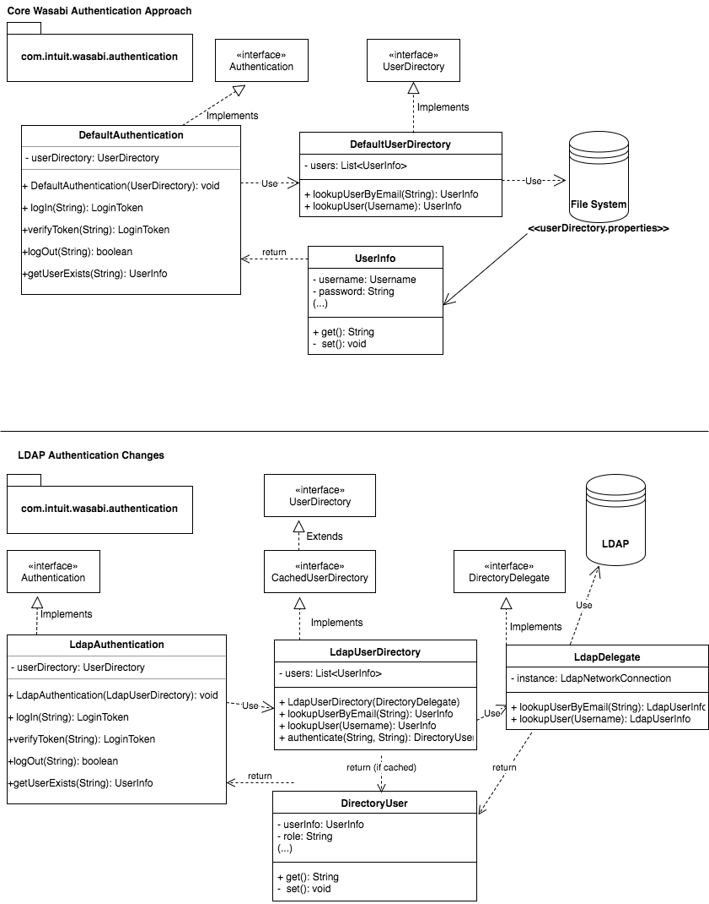

# Wasabi LDAP
**License:** [](http://www.apache.org/licenses/LICENSE-2.0) <br/>

## Project
This project is an extension to the [Wasabi](https://github.com/intuit/wasabi/) platform for A/B testing. Currently, Wasabi only supports authentication via a flat file with hardcoded username/passwords. Obviously this is not ideal even in a mid-size environment with collaborating team members.

To support new authentication mechanisms, this project adds support for a cached directory service and provides a default implementation for connecting and using an LDAP server as the sole source of both authentication and authorization details.

Using a variety of configuration options, the project aims to handle your customization needs. By incorporating mix-in classes to divide responsibility and separate concerns, the project aims to allow for easy extension to support new services in the future. 

### Features
* **Customizable** - Wasabi LDAP takes all parameters via configuration parameters. This allows you to customize to your specific LDAP configuration.
* **Extendible** - Though the design of this project is highly configurable, all of our classes are both extendable and OOP swappable. Configure where possible, extend where necessary!
* **Simplified security with increased performance** - All security is managed via LDAP--simplifying your user management. Furthermore, using encrypted passwords/cookies and a cached user directory, this project builds and extends existing Wasabi classes and functionality.

## Installation
### Option A: Deploy the compiled JAR as a dependency
Wasabi-LDAP is deployed in the Maven central repository. *TBD/WIP* -- Need to apply for `com.neighborhoods` repository in Maven Central for hosting our public projects
 1. Add the following to your main Wasabi `pom.xml` under the `<dependencies>` section:
	  ```xml
	<dependency>
		<groupId>com.neighborhoods</groupId>
		<artifactId>wasabi-ldap</artifactId>
		<version>0.1.0</version>
	</dependency>
	```
 1. Complete the configuration process below.

### Option B: Include the source files directly in your build
 *See [Extending Wasabi LDAP](#extending-wasabi-ldap) section for guidance on this approach*
 
## Configuration 
Wasabi LDAP follows the same property usage pattern as core Wasabi. Parameters are loaded via the following hierarchy (later options take precedence):
 * Root `pom.xml` of the Wasabi project. Important Notes: 
      * You must include the `wasabi-ldap` module and build from source if you elect to use this method of property injection.
      * All properties (even unused/unchanged properties) must be specified in the `pom.xml`. Use an empty value to defer to the default.
 * Manually modified in the `ldap.properties` file included in the main JAR
 * Set as environment variables at runtime
 
| Property              | Description   | Example Value  |
| --------------------- |:-------------------------------------------------------------| :----------------:|
| user.lookup.class.name| This is the core Wasabi UserDirectory implementor. To use LDAP, this must be set to a class that also implements the CachedDirectory interface | `com.neighborhoods.wasabi.ldap.impl.LdapUserDirectory` |
| authorization.class.name | This is the core Wasabi Authorization interface implementor. A default implementer that uses the CachedDirectory interface has been provided.      |   `com.neighborhoods.wasabi.ldap.impl.DirectoryAuthorization` |
| authentication.class.name | This is the core Wasabi Authentication interface implementor. A default implementer that uses the CachedDirectory interface has been provided.      |   `com.neighborhoods.wasabi.ldap.impl.DirectoryAuthentication`  |
| ldap.delegate.class | This is the DirectoryDelegate implementor. A default implementor for LDAP has been provided. | `com.neighborhoods.wasabi.ldap.impl.LdapDelegate` |
| ldap.host | The host name for the LDAP server. Note: If using a LDAP server on the same host as the docker image, use the `docker.for.mac.localhost` reserved hostname. | `123.456.78.9` |
| ldap.dn.base | The base distinguished name for all queries. | `dc=example,dc=com` |
| ldap.dn.wasabi | The Wasabi distinguished name. Groups will be queried under this dn. | `cn=Wasabi,dc=example,dc=com` |
| ldap.dn.info | An information distinguished name is used for querying LDAP for user details (e.g. for the user list). | `cn=info,dc=example,dc=com` |
| ldap.dn.info.password | The bind password for the info dn. | `Example123` |
| ldap.port | The port LDAP is listening on. | `10389` |
| ldap.secure | Whether to secure the LDAP connection | `false` |
| ldap.login.attribute | The attribute name to access the login value. | `uid` |
| ldap.member.attribute | The attribute name to access the member value(s) for Wasabi groups. | `member` |
| ldap.role.attribute | The attribute name to access the role group for a user. | `cn` |
| ldap.bcrypt.rounds | The number of rounds bCrypt should be applied to encrypt a user authorization token | `7` |
| ldap.group.admin | The group name for the Admin role (read/write/delete for all applications) | `Admin` |
| ldap.group.superadmin | The group name for the Admin role (read/write/delete for all applications, clear cache) | `SuperAdmin` |
| ldap.group.reader | The group name for the Reader role (read for all applications) | `Reader` |
| ldap.group.writer | The group name for the Writer role (read/write for all applications) | `Writer` |
| ldap.person.email.attribute | The attribute name for accessing a user's email address | `mail` |
| ldap.person.first.attribute | The attribute name for accessing a user's first name | `givenname` |
| ldap.person.last.attribute | The attribute name for accessing a user's last name | `sn` |

### Clearing Cache
For performance reasons, Wasabi LDAP caches user objects after retrieving them from LDAP. Due to UI limitations, the project injects a simulated user into the Super Admin list (you must be in the super admin group to access this list). 

To clear the cache (e.g. if you are concerned about a user you recently removed from the LDAP group), simply click the delete button for the simulated user:


## Extending Wasabi LDAP
At [Neighborhoods.com](Neighborhoods.com), we are committed to utilizing the best open source solutions. We know the value of a good neighbor and the software community is no different. That is why we chose to build and share this extension publicly. Under a generous Apache2 license, we hope to inspire further contributions to Wasabi and our own extension. 

Wasabi LDAP builds on the base interfaces of Wasabi. Below is an overview of key classes:
 ```java 
 package com.neighborhoods.wasabi.ldap;
 
 public interface CachedUserDirectory extends UserDirectory {};
 public interface DirectoryDelegate {};
 
 package com.neighborhoods.wasabi.ldap.impl;
 
 public class DirectoryAuthentication implements Authentication {};
 public class DirectoryAuthorization implements Authorization {};
 public class LdapDelegate implements DirectoryDelegate {};
 public class LdapUserDirectory implements CachedUserDirectory {};

```

To build Wasabi and include the LDAP module:
1. Create the directory `modules/ldap` and checkout the LDAP project via git.
	`git checkout https://github.com/neighborhoods/Wasabi-LDAP`
1. Update the root `pom.xml` and add `<module>modules/ldap</module>` under the `<modules>` tag.
1. For any build with LDAP source files included, you *must* add all of the following properties in your root `pom.xml` within the `<properties>` parent tag. This is so the downstream property files are initialized properly. Be sure to have this section replace the existing `DefaultAuthentication` and `DefaultAuthorization` properties. For all LDAP configuration options, if you want to specify the values downstream or use the default value simply leave the tag values blank:
	```xml
	<!-- LDAP -->
		<user.lookup.class.name>com.neighborhoods.wasabi.ldap.impl.LdapUserDirectory
		</user.lookup.class.name>
		<authorization.class.name>com.neighborhoods.wasabi.ldap.impl.DirectoryAuthorization
		</authorization.class.name>
		<authentication.class.name>com.neighborhoods.wasabi.ldap.impl.DirectoryAuthentication
		</authentication.class.name>
		<!-- Dynamic delegate configuration only works if the LDAP module is actually installed via Guice -->
		<ldap.delegate.class>com.neighborhoods.wasabi.ldap.impl.LdapDelegate
		</ldap.delegate.class>
		<ldap.host>docker.for.mac.localhost</ldap.host>
		<ldap.dn.base>dc=example,dc=com</ldap.dn.base>
		<ldap.dn.wasabi>cn=Wasabi,dc=example,dc=com</ldap.dn.wasabi>
		<ldap.dn.info>cn=info,dc=example,dc=com</ldap.dn.info>
		<ldap.dn.info.password>examplePassword</ldap.dn.info.password>
		<ldap.bcrypt.rounds></ldap.bcrypt.rounds>
		<ldap.port></ldap.port>
		<ldap.secure></ldap.secure>
		<ldap.login.attribute></ldap.login.attribute>
		<ldap.member.attribute></ldap.member.attribute>
		<ldap.role.attribute></ldap.role.attribute>
		<ldap.group.admin></ldap.group.admin>
		<ldap.group.superadmin></ldap.group.superadmin>
		<ldap.group.reader></ldap.group.reader>
		<ldap.group.writer></ldap.group.writer>
		<ldap.person.email.attribute></ldap.person.email.attribute>
		<ldap.person.first.attribute></ldap.person.first.attribute>
		<ldap.person.last.attribute></ldap.person.last.attribute>
	<!-- /LDAP -->
	```
1. Now that LDAP source files will be compiled and configured, they need to be included in the final JAR. Add the artifact as a dependency to any module (recommended module is `main` since this is the last module built and should avoid circular dependency references). Edit `modules/main/pom.xml` and add the following to the `<dependencies>` section:
	```xml
	<dependency>
	    <groupId>com.neighborhoods</groupId>
	    <artifactId>wasabi-ldap</artifactId>
	    <version>0.1.0</version>
	</dependency>
	```
1. Add the following line to the `bin\build.sh` file to include the LDAP properties file in the final jar:
	```
	cp ./modules/ldap/target/classes/ldap.properties ${home}/${id}/conf
	```
1. (*Optional*) If you need to change the default implementer for any of the delegate interfaces, you can modify the appropriate `@Implements` tag in the interface file or install the `LdapModule` via another core Wasabi module (`configure() {install(new LdapModule());}`) to have the `LdapModule` load delegates dynamically at run time via the configuration.

Note: Wasabi-LDAP specifies the dependency version of core Wasabi in its `pom.xml` as the last tested snapshot version of Wasabi that was compiled successfully (e.g. `<version>1.0.20170418213834-SNAPSHOT</version>`). You may need to adjust the version dependency if you are using a newer version of Wasabi. As long as the underlying `Authentication` and `Authorization` interface contracts do not change, Wasabi LDAP should be forward-compatible with all new versions.

# References
## Overview of changes from core Wasabi
*Note this diagram shows Authentication changes for explanatory purposes. Additional changes outside of Authentication were also performed (e.g. to Authorization)*

## Java 8 Features
Both Wasabi and Wasabi-LDAP make use of Java8 features you may not typically encounter in other projects. Below are a few nuances to consider when reviewing the code or if you choose to extend the project.
 * [try{} with resource](https://docs.oracle.com/javase/tutorial/essential/exceptions/tryResourceClose.html) - All LDAP related calls are wrapped in try with resource blocks. This handles exceptional behavior differently than typical `try` blocks and automatically opens and closes resources.
 * [Stream support](http://www.oracle.com/technetwork/articles/java/ma14-java-se-8-streams-2177646.html) - All collections are traversed and filtered using stream support to increase efficiencies and properly handle larger data sets. (No more iterators!)
 * [Concurrency Classes](https://docs.oracle.com/javase/8/docs/api/java/util/concurrent/ConcurrentHashMap.html) - Generally thread safe operations are handled transparently via built in concurrent classes.
